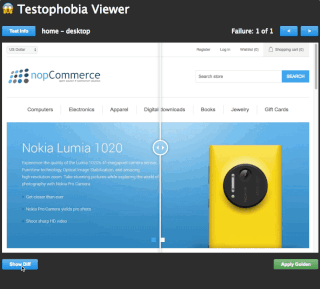

# 😱 testophobia

Taking the fear out of web application snapshot testing

## Overview

Testophobia runs a web browser<sup>\*</sup> headless and performs the UI actions that you specify,
taking screenshots of the page along the way.  It will compare these snapshots to previously taken versions (that are
known to be correct), and validate that the page still looks and behaves as it should.

<sup>\* Only Google Chrome currently</sup>

## Install

```bash
$ yarn global add testophobia
```

or

```bash
$ npm i -g testophobia
```

## Running Testophobia

Once installed, you should have the __testophobia__ command available in your PATH.  If you did not install Testophobia globally, you'll probably want to prepend the __npx__ command when invoking __testophobia__.

However, first you'll want to configure your project.

### Basic Example

Probably the easiest way to learn Testophobia is by example.  Examples have been provided in the __examples__ subfolder.

Let's look at the __basic__ example.  In the _pages_ directory, you'll find some rudimentary HTML pages for testing.
For simplicity, these pages are being hosted on
[Github Pages](https://testophobia.github.io/testophobia/examples), so that you can run example tests
against them without the need to host the pages yourself.

First, let's look at the Testophobia configuration file, located in the root of the basic example:

```javascript
export default {
  tests: 'tests/**/*-test.js',
  dimensions: [
    {
      type: "desktop",
      width: 1024,
      height: 768
    },
    {
      type: "tablet",
      width: 768,
      height: 1024
    },
    {
      type: "mobile",
      width: 350,
      height: 667
    }
  ],
  fileType: "jpeg",
  threshold: 0.2,
  baseUrl: 'https://testophobia.github.io/testophobia/examples/basic'
};
```

The configuration file exports a single default object with all of the configurations for the project.

In the basic example, we've specified the path to our test files (using [file globs](https://github.com/isaacs/node-glob#glob-primer)),
and then configured each of the window dimensions we want to test for.  We also set the output file type as JPEG images,
a threshold of 0.2 (see the [PixelMatch](https://github.com/mapbox/pixelmatch#pixelmatchimg1-img2-output-width-height-options)
threshold setting for more info), and the baseUrl of our site.

Now, for each page we're testing, we create a test file, e.g. _tests/home/home-test.js_

```javascript
export default {
  name: "home",
  actions: [
    {
      type: "click",
      target: "#btn"
    }
  ]
};
```
For this test, we've told Testophobia to navigate to the _/home_ page, take a snapshot, click the __#btn__ element,
then take another snapshot.

Since we don't have any golden images yet, the first thing we'll want to do is generate them:

```
$ testophobia --golden
✔ Finished generating golden screens! (9.5s)
```

Now, with golden images in place, we can re-run the tests and validate that the pages still match the golden images:

```
$ testophobia
✔ Finished generating test screens! (9.6s)
💪 Testophobia screenshot compare complete!

Testophobia Results: [ 9/9 Pass ]
```

and after making a change to the source HTML file (resulting in a failure):

```
$ testophobia
✔ Finished generating test screens! (9.3s)
home desktop Pixel Difference: 1634

 - Diff file location: ./testophobia/diffs/home-desktop-10-22-2018_15-3-50-diff.png

home tablet Pixel Difference: 1634

 - Diff file location: ./testophobia/diffs/home-tablet-10-22-2018_15-3-50-diff.png

home mobile Pixel Difference: 1634

 - Diff file location: ./testophobia/diffs/home-mobile-10-22-2018_15-3-50-diff.png

💪 Testophobia screenshot compare complete!

Testophobia Results: [ 6 Pass | 3 Fail ]
```

## Testophobia Viewer

Testophobia also includes a web-based viewer tool, for comparing and resolving test failures.  When a test run has
failures, the viewer will automatically be displayed in your default browser.



The viewer provides a handy slider to quickly compare the test image and its corresponding golden image.  You also have
the ability to display the __image diff__ (and adjust its opacity), as it is sometimes difficult to locate subtle
differences in test failures.

Finally, in the event that the test image is in fact valid, and should replace the current golden snapshot as the new
golden, you can use the __Apply Golden__ feature of the viewer to apply the new image, without the need to perform
another _--golden_ run.

## Config Options

The following options are available in the Testophobia config file, or via the configuration object passed to the
Testophobia instance:

`projectDir`: (string) the desired root project directory for the project | default: cwd

`baseUrl`: (string) the base url of your website or application | default: http://localhost:6789

`golden`: (boolean) generate the golden screenshots

`fileType`: (string) the image type to output (options: jpeg, png) | default: png

`quality`: (number) if jpeg fileType, the quality setting (1-100) for the image | default: 80

`dimensions`: (array) the type / dimensions for the screenshot | default: desktop (1024x768) and mobile (375x812)

- `type`: (string) the desired name of the defined device/resolution/dimension

- `width`: (number, in px) the desired width of the screenshot

- `height`: (number, in px) the desired height of the screenshot

- `scale`: (decimal) the scale of the screenshot by percentage (from 0 to 1) (see [__Image Scaling__](#image-scaling) below) | default: 1

`testDirectory`: (string) desired file location for the test screenshots | default: ./testophobia/test-screens

`goldenDirectory`: (string) desired file location for the golden screenshots | default: ./testophobia/golden-screens

`diffDirectory`: (string) desired file location for the diff screenshots (failures) | default: ./testophobia/diffs

`threshold`: (decimal) sets the strictness of the comparison (from 0 to 1) | default: 0.2

`tests`: (string|array) test definitions or glob path to test files

### Test Definition

Test definition properties:

`name`: (string) the name of the test (also used as the path, if path is not defined)

`path`: (string) the path to the page to be tested, relative to the baseUrl

`delay`: (number) the amount of time (in ms) on page load to delay before taking the first screenshot

`actions`: (array) list of interactions to perform sequentially. Each action is an object consisting of:

- `type`: (string) the type of action to run.  supported actions include:

  - `click` - performs a mouse click against the specified target

  - `scroll` - scrolls the element to the desired position

    - `scrollTop`: (number) the desired Y offset (in px) the element should be scrolled to

    - `scrollLeft`: (number) the desired X offset (in px) the element should be scrolled to

  - `setProperty` - set a property on the target HTML element

    - `property`: (string) the desired property to set. examples: value, textContent

    - `value`: (string) the value to set on the property

  - `setAttribute` - set an attribute on the target HTML element

    - `attribute`: (string) the desired attribute to set. examples: disabled, src

    - `value`: (string) the value to set on the attribute

  - `removeAttribute` - remove an attribute on the target HTML element

    - `attribute`: (string) the desired attribute to remove. examples: disabled, src

  - `hover` - hover the mouse over the specified target

- `target`: (\*) the target HTML element to perform the action on. Takes a selector or element reference

- `delay`: (number) the amount of time (in ms) to delay before taking a screenshot, after performing the action

- `skipScreen`: (boolean) whether to skip taking a screenshot after performing the action


### Image Scaling

Since golden images need to be stored for later validation, Testophobia has an optional config value to _scale_ the
images upon generation.  By scaling the images, you can greatly reduce the file size of the images.  However, the more
the images are scaled, the greater the chance that differences may be too small to detect. This will require
experimentation and YMMV.

## JavaScript API

Testophobia provides a JavaScript API for running tests within a Node.js environment.

```javascript
//import the Testophobia library
const {Testophobia} = require('./node_modules/testophobia/lib/testophobia');

//create a Testophobia instance, and configure
const tp = new Testophobia({
  projectDir: '/path/to/project/dir',
  baseUrl: 'http://localhost:6789',
  golden: false,
  tests: [
    {
      name: 'home',
      actions: [
        {
          type: 'click',
          target: '#btn'
        }
      ]
    }
  ]
});

//run the tests
const result = await tp.run();
```

You can also pass a path/glob for tests as a parameter to the Testophobia run() method to perform tests programmatically:

```javascript
const result = await tp.run('tests/about/*-test.js');
```

Examples using the JavaScript API can be found in the _examples/javascript-api_ directory.

## Command Line Options

The __testophobia__ command optionally takes a few additional arguments:

`[<file|directory|glob> ...]`: Tests can be run ad-hoc by passing the path/glob as a parameter.  This overrides the
__tests__ configuration value. Example:

```
$ testophobia path/to/my/tests/**/*-test.js
```

`--skip-viewer`: prevents the Testophobia viewer from displaying automatically on test failure

`--clear`: deletes all of the generated golden/test/diff images and directories

`--verbose`: provides additional output during Testophobia invocations

`--golden`: generate the golden screenshots

## LICENSE

MIT
